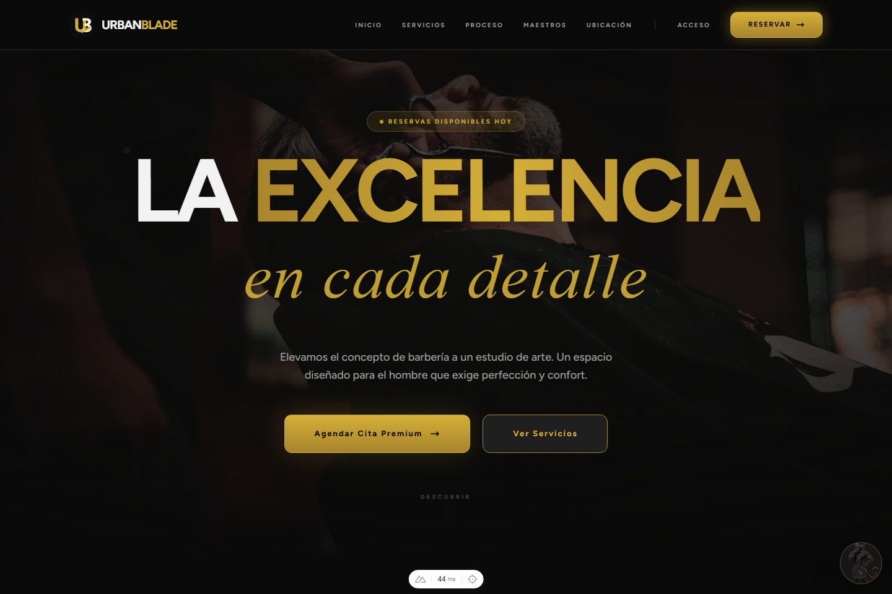
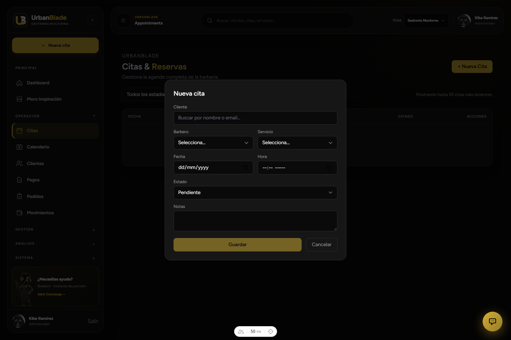
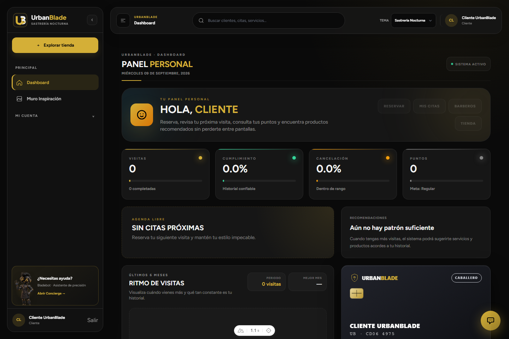
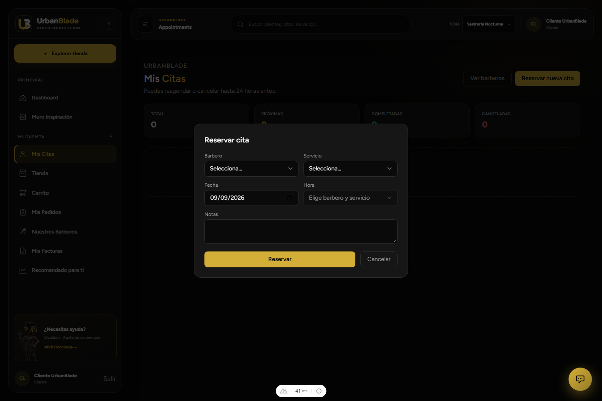

# UrbanBlade — frontend-urban

<p align="center">
  
</p>

Frontend real de UrbanBlade (barbería): Nuxt 4, consume la API JSON del repositorio
hermano [`barber`](https://github.com/KikeGonRam/barber) (Laravel 13 + MongoDB) por
Bearer token propio (`mobile_api_tokens`, **no** Sanctum). Aquí viven los 4 dashboards
por rol (administrador, recepcionista, barbero, cliente), citas, pagos, inventario,
tienda, campañas, reportes, analítica, muro social y reseñas — todo lo que el panel
Blade/Inertia de `barber` tenía antes de retirarse por completo el 2026-09-06 al
alcanzar esta app paridad funcional confirmada.

## ✨ Qué hace

- **Reserva de citas con disponibilidad real**: al elegir barbero + servicio + fecha,
  el formulario consulta `/availability/slots` y solo ofrece horarios realmente
  libres — nunca un horario que el backend vaya a rechazar.
- **4 experiencias por rol**: administrador (KPIs globales, control operativo),
  recepcionista (agenda del turno, cobros), barbero (agenda personal, portafolio,
  aprobación de citas), cliente (reservas, historial, tienda, membresía, lealtad).
- **Pagos reales**: Stripe (tarjeta, beta), transferencia con comprobante, efectivo —
  todo con el monto recalculado server-side, nunca confiando en lo que el cliente envía.
- **4 temas visuales** (Sastrería Nocturna / Taller de Acero / Salón Inglés / Libreta
  de Barbero) intercambiables en vivo, con mascotas contextuales (Nava, Bladebot,
  Bruno) que guían estados vacíos, errores y ayuda.
- **Programa de lealtad**: puntos, niveles, descuentos automáticos y tarjeta de
  membresía digital con QR.

## 📸 Vista previa

<p align="center">
  
</p>

<p align="center"><em>Acceso — correo/contraseña o Google, con mascota de bienvenida (Nava) y los cuatro temas disponibles desde el primer momento.</em></p>

<p align="center">
  
</p>

<p align="center"><em>Panel administrativo — KPIs del día (citas, ingresos, clientes, retención), accesos rápidos y agenda del día, con el sidebar de navegación completo por módulo (Operación, Gestión, Análisis, Sistema).</em></p>

<p align="center">
  
</p>

<p align="center"><em>Citas &amp; Reservas — alta de citas para administración/recepción, con los mismos campos de barbero/servicio/fecha/hora que usa el cliente.</em></p>

<p align="center">
  
</p>

<p align="center"><em>Panel del cliente — próxima cita, ritmo de visitas, recomendaciones y tarjeta de membresía digital, todo desde la cuenta del propio cliente.</em></p>

<p align="center">
  
</p>

<p align="center"><em>Reservar cita (cliente) — en cuanto se elige barbero y servicio, el campo de hora se llena solo con los horarios que ese barbero de verdad tiene libres ese día; si no hay ninguno, lo dice en vez de dejar elegir cualquier hora.</em></p>

## 🏗️ Stack

- Nuxt 4 + Vue 3 + TypeScript
- Tailwind CSS 3 (`@nuxtjs/tailwindcss`), 4 temas por tokens CSS
- Chart.js (métricas), FullCalendar (agenda/citas)
- Stripe Elements (cobro con tarjeta, beta)
- Playwright para E2E, contra el **build de producción**, no `nuxt dev`

## 🧭 Roles del sistema

| Rol | Visión principal |
| --- | --- |
| Administrador | Dashboard global, reportes, KPIs, clientes, pagos, inventario y control operativo. |
| Recepcionista | Agenda del día, atención rápida, cobros y gestión de clientes. |
| Barbero | Horario personal, citas, perfil, portafolio y seguimiento de actividad. |
| Cliente | Reservas, historial, tienda, carrito, facturas y membresía. |
| Ingeniero | Solo lectura: reportes, logs y estado del sistema (`/pulse`), nunca gestión. |

## 🚀 Requisitos

- Node 24 (ver `.github/workflows/ci.yml`)
- El backend (`barber`) corriendo en `http://127.0.0.1:8000` — ver ese repo para
  levantarlo con Docker Compose (incluye MongoDB, Redis, colas y el worker de
  notificaciones)

## Arranque local

```bash
npm install --legacy-peer-deps
npm run dev
```

Sirve en `http://localhost:3000` (a veces solo en `http://[::1]:3000` — el servidor
de Nuxt puede quedarse escuchando únicamente en IPv6 según el entorno; un navegador
normal lo resuelve igual, solo afecta a diagnósticos por `curl`). Por defecto apunta
a `http://127.0.0.1:8000/api/v1` — configurable con `NUXT_PUBLIC_API_BASE`.

`--legacy-peer-deps` es necesario por un bug conocido de npm con el grafo de
peer-dependencies de Nuxt 4 (ver `.claude/skills/nuxt-migration-plan/SKILL.md`).

Credenciales de demo (una cuenta por rol): ver `docs/ACCESOS.md` en `barber` —
mismo criterio ahí, no se duplican aquí.

## 🧪 Pruebas y validación

```bash
npm run lint                       # eslint
npm run build                      # build de producción
npm run test:e2e                   # Playwright, contra el build ya compilado
```

CI (`.github/workflows/ci.yml`) corre dos jobs en cada push/PR a `main`:

- **Frontend**: `eslint . --max-warnings=0` (más estricto que `npm run lint` local —
  probar siempre con el flag exacto antes de pushear), `npm run build`, `npm audit
  --audit-level=high`.
- **E2E**: Playwright contra `nuxt build && nuxt preview` (puerto 3100, no 3000 — no
  reutiliza un `npm run dev` que pueda estar corriendo). La API de `barber` se
  intercepta en el navegador (`e2e/support/api-mock.ts` + `e2e/support/mock-api.mjs`
  para las peticiones que Nuxt resuelve en SSR), así que este job no necesita
  Laravel/Mongo/Redis corriendo.

## 📚 Documentación relacionada

- `.claude/skills/urbanblade-completion-roadmap/SKILL.md` (y su copia en
  `.agents/skills/`) — historial completo de las 6 fases del roadmap coordinado con
  `barber`: hallazgos, commits, verificación.
- `.claude/skills/nuxt-migration-plan/SKILL.md` — arquitectura y decisiones de la
  migración original desde el panel Blade/Inertia.
- `.claude/skills/git-commit-conventions/SKILL.md` — convención de mensajes de commit
  (español, un solo autor humano).
- `design-qa.md` — notas de auditoría visual/UX del sidebar y los 4 temas.
- `docs/IDENTITY_MASCOT_SIDEBAR_PLAN.md` — sistema de identidad, mascotas y temas.
- `docs/ENGINEER_OBSERVABILITY_DASHBOARD_PLAN.md` — ADR del panel de solo lectura
  para el rol ingeniero.
- En `barber`: `.claude/skills/urbanblade-guardrails/SKILL.md` — reglas de seguridad y
  el historial de incidentes que afectan a ambos repos (base de datos compartida,
  contrato de API, etc.).
